# 											Juan(祖安)博客


## 项目简介

### :basketball_man:代码目录

##### 服务器端

* zzw-service：

  * zzw-common：公共模块
    * zzw-common-core：公共核心模块
    * zzw-common-security：springSecurity配置模块

  * zzw-module：业务相关模块
    * zzw-admin-user：后台权限管理相关API（可以拿这模块当基础模板进行开发新项目）
    * zzw-blog：后台博客管理和所有前台展示相关API
    * zzw-core-api：业务模块核心模块

  * zzw-visual：一些辅助模块
    * zzw-generator：代码生成器。（只能在代码中输入表名，会成集成了swagger的controller，pojo，service，dao，daoxml ）

##### 后台管理端

* zzw-admin-vue

##### 前台展示端

* zzw-front-vue


:m:

```
前端按模板开发的，目录结构就不多做介绍了，几乎一致。
开发该项目的初衷就是为了巩固自身vue和springcloud相关的技术，所以用的的很多技术都是为了技术而技术，但后面发现个人云服务器无法支撑微服务架构的后台项目.
然后就没有对后台项目进行微服务的改造。然后所有的请求接口都通过nginx进行代理转发,有兴趣可以自行改造成微服务
```


##  服务器端

##### :aerial_tramway: 技术栈

* 主体框架：springboot2.1.0.RELEASE+jdk1.8
* OEM框架：mybatis-plus3.3.2
* 文件管理：七牛云（需要有自己七牛云账号，并配置好相应的空间域名）
* 数据库：mysql8.0+redis
* 服务转发：nginx
* JAR包管理：maven3.0
* 安全框架：springsecurity+jwt
* 密码加密：MD5简单加密

## 后台管理端

##### :aerial_tramway:技术栈

* 主题架构：element-ui+vuecli3.0
* 请求工具：axios
* 项目模板：[vue-admin-template](https://gitee.com/panjiachen/vue-admin-template)

* 图标库：iconfont

## 前端展示端

##### :aerial_tramway:技术栈

* 主体架构：iview4.0(view-design)+vuecli3.0(这里前台推荐使用nuxt渲染页面，我偷懒没对其进行改造)
* 请求工具：axios
* 项目模板：[vue-admin-template](https://gitee.com/panjiachen/vue-admin-template)

* 图标库：iconfont

* 前端布局借鉴：[答案博客，vue+springboot](https://gitee.com/aqian666/blog)
* 评论插件：gitalk


 ## :framed_picture:后台管理端图片展示

<table>
    <tr>
        <td ><center>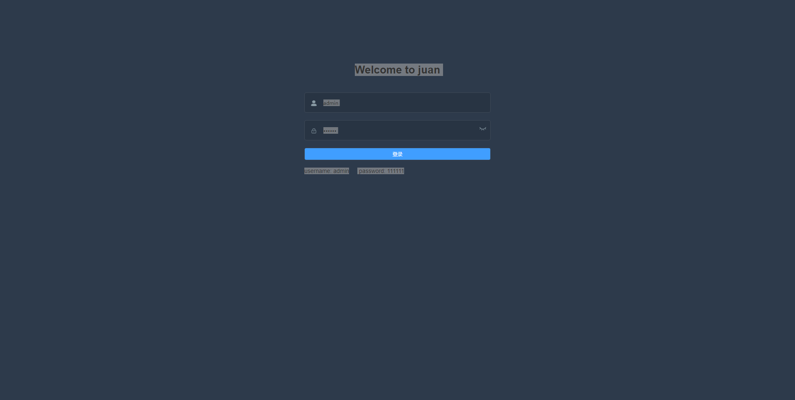后台管理登陆</center></td>
		<td ><center>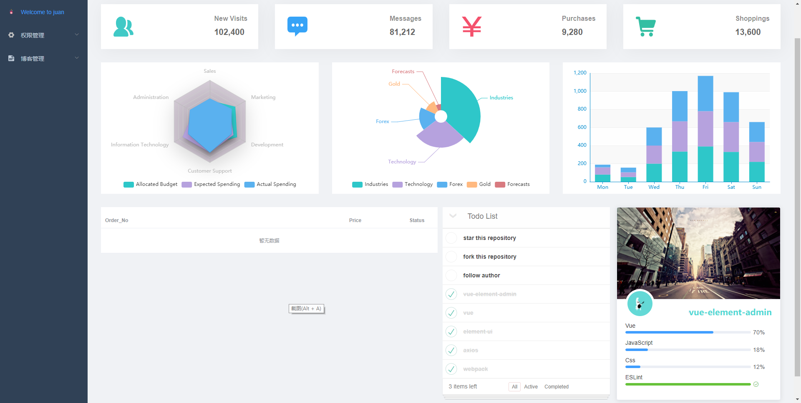后台管理首页</center></td>
    </tr>
    <tr>
        <td ><center>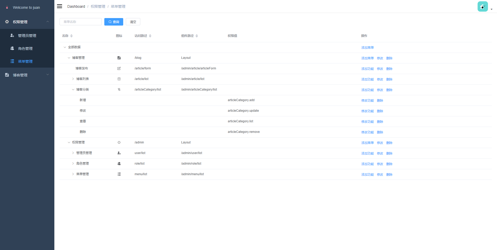后台菜单管理</center></td>
		<td ><center>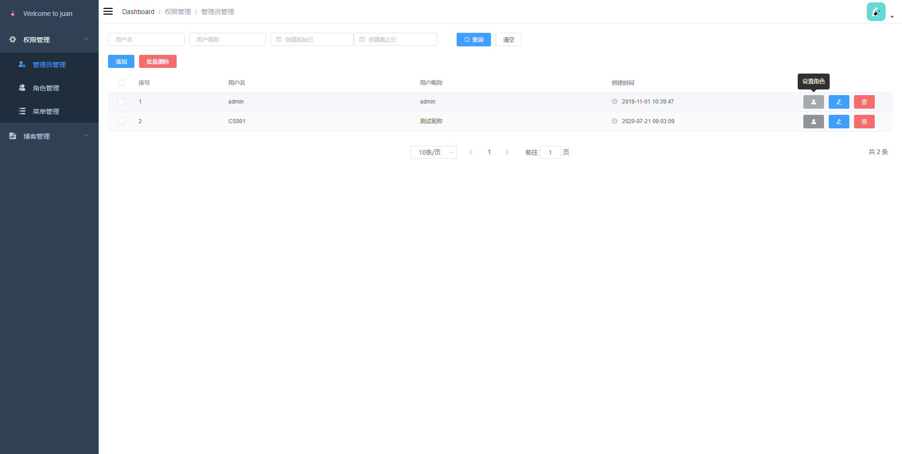后台管理端员工管理</center></td>
    </tr>
    <tr>
        <td ><center>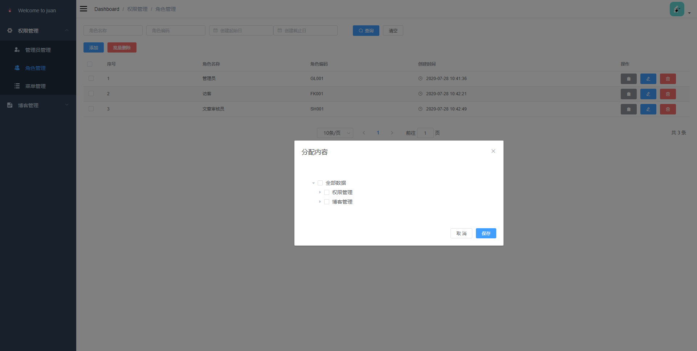后台角色</center></td>
		<td ><center>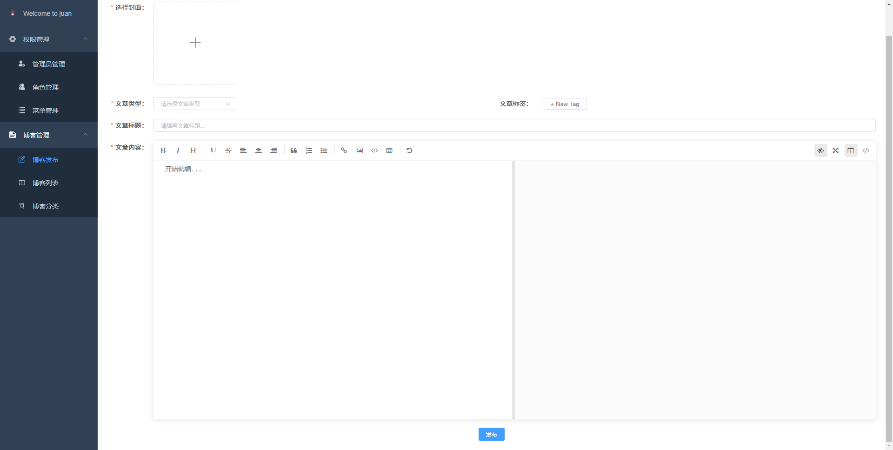文章发布</center></td>
    </tr>
</table>


 ## :framed_picture:前台图片展示

<table>
    <tr>
        <td ><center>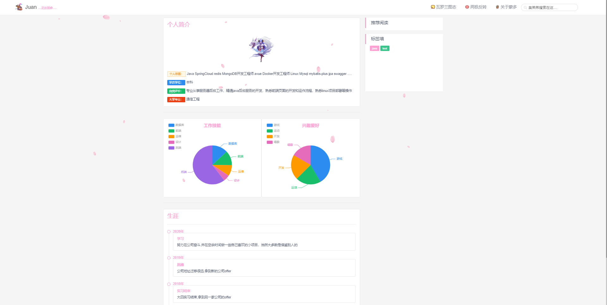前台关于蒙多</center></td>
		<td ><center>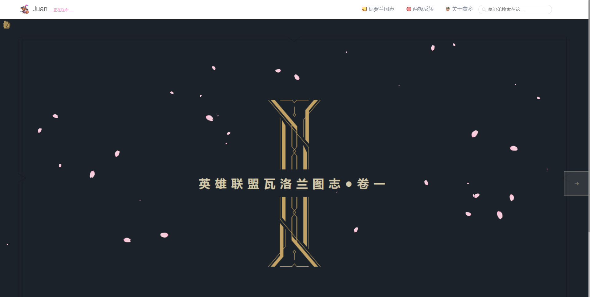前台瓦罗兰图志</center></td>
    </tr>
    <tr>
        <td ><center>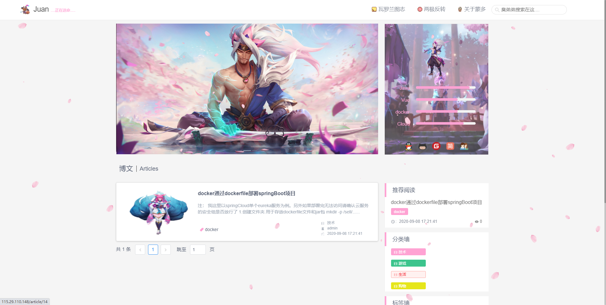前台首页</center></td>
		<td ><center>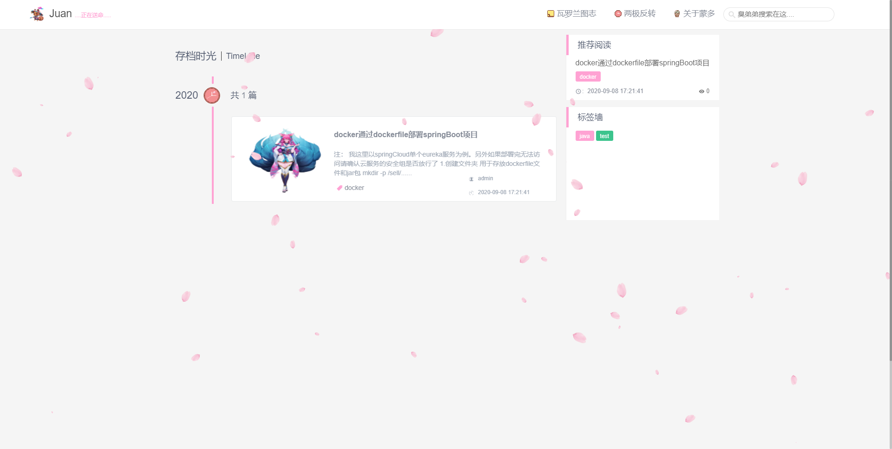前台时间轴</center></td>
    </tr>
    <tr>
        <td ><center>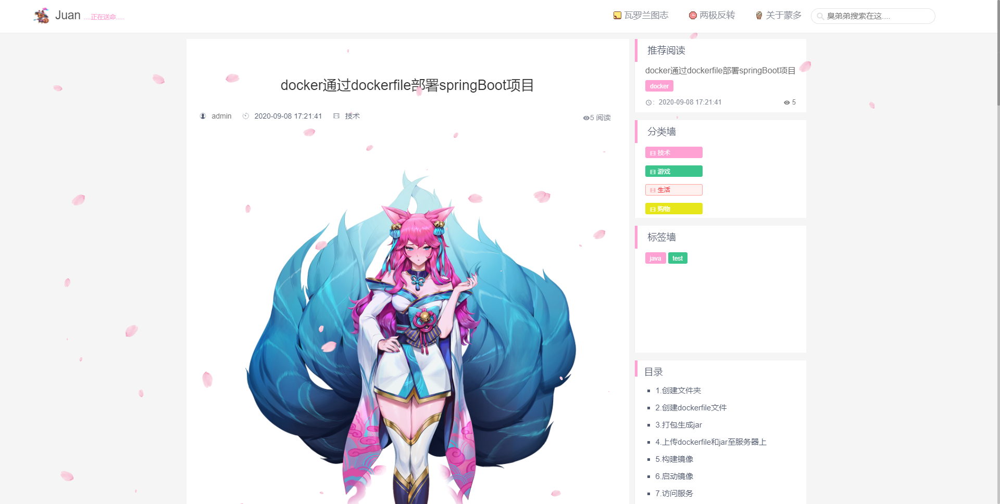文章详情1</center></td>
		<td ><center>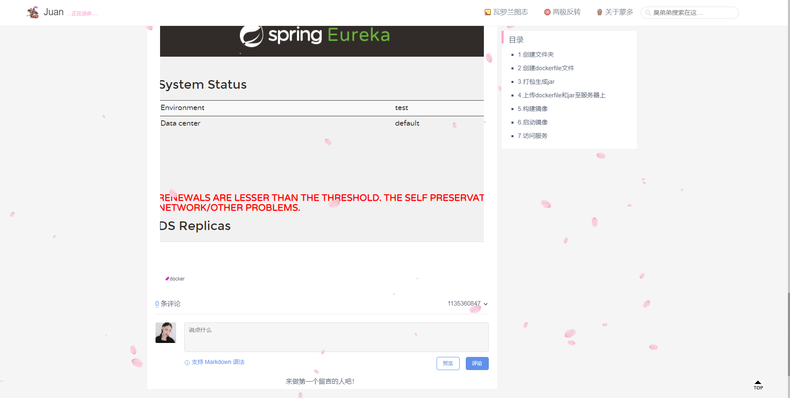文章详情2</center></td>
    </tr>
</table>


